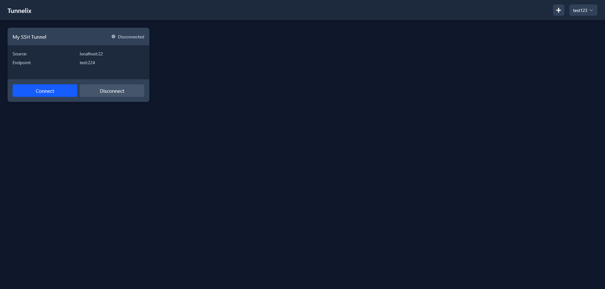

# Repo Stats

#### Top Technologies

 

  

If you would like, you can support the project here!\

# Overview
Tunnelix is an open-source forever free self-hosted SSH tunnel management system designed to simplify the creation and management of SSH tunnels through an elegant web interface. It allows you to securely connect to remote servers and port forward local services through SSH tunnels from anywhere with a web browser.

# Features
- User Management (authentication, guest access, admin controls)
- SSH Tunnel Creation and Management
- Save Tunnel Configurations
- Share Tunnels Between Users
- Automatic Reconnection on Failure
- Customizable Retry Settings
- Auto-start Tunnels on Boot

# Installation
Visit the Tunnelix [Wiki](https://github.com/LukeGus/Tunnelix/wiki) for information on how to install Tunnelix. You can also use these links to go directly to guide. [Docker](https://github.com/LukeGus/Tunnelix/wiki/Docker) or [Manual](https://github.com/LukeGus/Tunnelix/wiki/Manual).

# Support
If you need help with Tunnelix, you can join the [Discord](https://discord.gg/MUb6xuD7) server and visit the support channel. You can also open an issue or open a pull request on the [GitHub](https://github.com/LukeGus/Tunnelix/issues) repo. If you would like to support me financially, you can on [Paypal](https://paypal.me/LukeGustafson803).

# Show-off

# License
Distributed under the MIT license. See LICENSE for more information.
